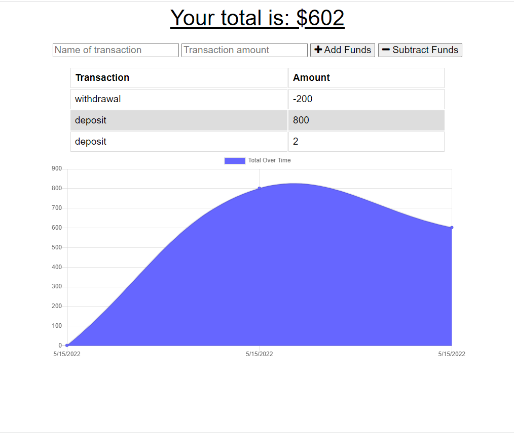
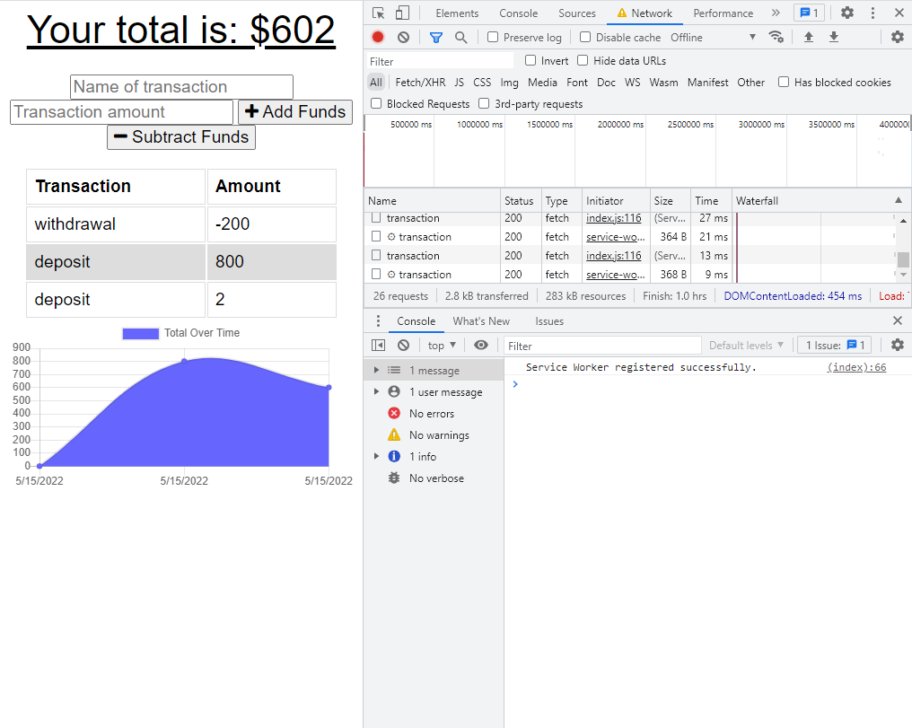

# Budget Tracker Starter Code

## Table of Contents

-[Description](#Description)

-[Programming Languages, Technologies/Frameworks](#Programming-Languages,-Technologies/Frameworks)

-[Installation](#Installation)

-[Contribution](#Contribution)

-[URL](#URL)

## Description

Updated an existing budget tracker application to a progressive web application (PWA) by allowing for offline access and functionality. The user will be able to add expenses and deposits to their budget with or without a connection.

## Programming Languages, Technologies/Frameworks

- HTML
- CSS
- Javascript
- NoSQL
- Express.js
- Mongoose
- MongoDB Atlas

## Installation

- clone/fork the repo
- run `npm i`
- run npm start

## Contribution

true

### Screenshots

### URL of the deployed application (GitHub Pages):

<https://gentle-headland-85061.herokuapp.com/>

### URL of the GitHub repository:

<https://github.com/adorsey5/budget-tracker>
